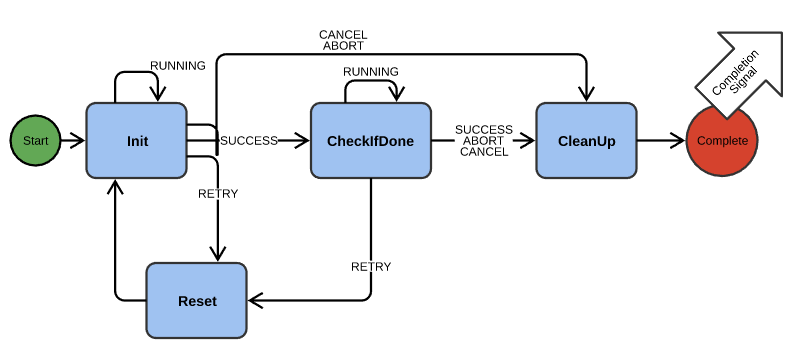

## Actions

### Quick Summary

* Common interface for discrete, generally closed-loop procedure that make the Robot "do something":
  * Move head/lift to position
  * Go to pose
  * Pick up object
  * Play animation
* Considered the building blocks of more complex [Behaviors](behaviors.md)
* Ticked by public `Update()`:
  * First initializes via internal `Init()`
  * Waits for criteria to be met in internal `CheckIfDone()`
  * Emits a completion signal/message when finished (success or failure)
* Exposed via messages to the external interface (e.g. SDK)
* Compound Actions allow composition of actions sequentially or in parallel

---

### Details

Actions are intended to provide a common interface for having the robot do some discrete motion or action which has some initialization, an update which takes time, and a completion, from simple closed-loop motions like moving its head to a certain angle, to more complicated coordinated procedures like docking with a cube or charger, or turning towards a face and saying the corresponding name. By using a common interface they can be sequenced and composed into complex behaviors.

Note that while "Actions" and [Animations](animations.md) are different, typically one plays an animation using a `TriggerAnimationAction`, which handles setting the current playing animation, waiting for it to finish, and notifying listeners of its completion.

These actions are also exposed via a message interface for the SDK or other users of the engine (e.g. the App) to create complex behaviors and games for the robot. See also the [messageActions.clad](../../clad/src/clad/externalInterface/messageActions.clad) file for definitins.

### Containers: ActionLists and ActionQueues
At the top level, the Robot has a list of actions to be run concurrently, called an ActionList. Each "slot" in the ActionList is actually an ActionQueue, which is a set of actions to be run sequentially. This is arguably overkill, but it does provide a lot of flexibility even if we typically just have one action running in a single ActionQueue in the ActionList.

### Base Class: IActionRunner
Inside the ActionQueue is a list of `IActionRunner` objects. `IActionRunner` defines the common interface for both simple actions and more complex compound actions (below). IActionRunners:

* Are ticked forward by their Update() method and also provide a Cancel() method to interrupt a running action. 
* Offer methods that can be overloaded as needed when an action resets and they provide automatic retry ability. 
* Can "lock" the head, lift, and/or wheels (using the Robot's `MovementComponent`), to indicate that the user should not be able to command those sub-systems while this action is executing. 
* Emit a completion signal when complete (success or failure)
* Have an CLAD-enumerated RobotActionType for use, for example, in communicating what kind of action finished in a message or signal. 

### Basic Interface: IAction

`IAction` derives from `IActionRunner` and is the interface for "simple" (non-compound) actions, from which most action classes will derive. Once they start running, updating them first calls their Init() method until it returns success. Then they call CheckIfDone() until it returns success. When either fails, they will abort or trigger a retry if desired. If a retry is triggered, Reset() is called and then they go back to Init(). After any completion – success, failure, or cancel – Cleanup() is called and a completion signal is emitted. Different wait times between these steps can also be provided. All of the specific behavior for a new Action derived from IAction is provided by overriding the class's virtual methods.

### Compound Actions
`ICompoundAction` also derives from `IActionRunner` and has two subclasses: `CompoundActionSequential` and `CompoundActionParallel`. As their names suggest, these are single Actions that internally possess a set of actions to either be run sequentially or in parallel. Note that completion signals are triggered only for the entire compound action, not for each constituent. Also note that you must take care not to try to run actions in parallel which try to lock the same "tracks" (e.g. two actions that both want to move the head).

### Action Tags ###
Actions also have ID Tags (just a uint32) for identifying specific instances of actions, allowing finer-grained control than just knowing their RobotActionType. Each IActionRunner receives a unique ID Tag at construction (whose value you can find out using GetTag()), but you can also use SetTag() to force your own value. Two example use cases for ID Tags are:

  1. Cancelling: You can specify an ID Tag to Lists' and Queues' Cancel() methods to only cancel a specific action, wherever it exists in the container.
  2. Completion Checking: The Completion Signal emitted by an IActionRunner will contain its Tag, so you can more accurately match which action just completed if necessary.  
Note that you can specify an ID Tag when you use QueueSingleAction and QueueCompoundAction messages to queue actions as well (since you can't know the auto-generated Tag created inside the engine when using the messaging interface).
